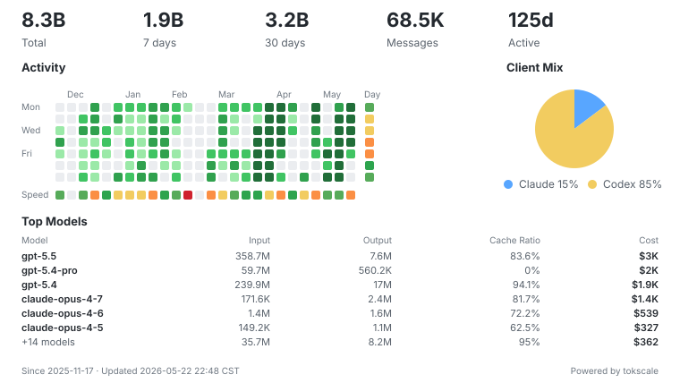

# Hi, I'm PekingSpades 👋

<!-- vibe-coding:start -->
## Vibe Coding

  <picture>
    <source media="(prefers-color-scheme: dark)" srcset="./assets/vibe-coding-dark.svg">
    <source media="(prefers-color-scheme: light)" srcset="./assets/vibe-coding-light.svg">
    
  </picture>

<!-- vibe-coding:end -->
## Open Source Contributions

| Repository | Stars | Description | Status |
|:-----------|:-----:|:------------|:------:|
| [badges/shields](https://github.com/badges/shields) |  | Fix merged-state detection for GitHub issue-detail PR badges |  |
| [novnc/noVNC](https://github.com/novnc/noVNC) |  | Optimize Websock receive queue reads via `DataView` |  |
| [asweigart/pyautogui](https://github.com/asweigart/pyautogui) |  | Fix horizontal scroll on Windows |  |
| [asweigart/pyautogui](https://github.com/asweigart/pyautogui) |  | Fix macOS double/triple-click |  |
| [go-vgo/robotgo](https://github.com/go-vgo/robotgo) |  | Fix macOS keyboard crashes |  |
| [go-vgo/robotgo](https://github.com/go-vgo/robotgo) |  | Fix `get_active` segfault |  |
| [go-vgo/robotgo](https://github.com/go-vgo/robotgo) |  | Add error-returning click helpers `ClickE` for safer mouse ops |  |
| [go-vgo/robotgo](https://github.com/go-vgo/robotgo) |  | Fix smooth drag not working on the macOS desktop and other apps |  |
| [jimmywarting/StreamSaver.js](https://github.com/jimmywarting/StreamSaver.js) |  | Fix Blob download memory leak |  |
| [jimmywarting/StreamSaver.js](https://github.com/jimmywarting/StreamSaver.js) |  | Fix abort errors for Blob-based downloads |  |
| [golang-design/clipboard](https://github.com/golang-design/clipboard) |  | Fail fast on Linux init errors; Add fallback loading |  |
| [keymanapp/keyman](https://github.com/keymanapp/keyman) |  | Fix stack overflow on 64-bit macOS |  |
| [thellmund/Android-Week-View](https://github.com/thellmund/Android-Week-View) |  | Add `beginWeekCalendar` to allow configuring the first day of the week |  |
| [CHENXCHEN/hexo-renderer-markdown-it-plus](https://github.com/CHENXCHEN/hexo-renderer-markdown-it-plus) |  | Add image processing support |  |
| [nut-tree/libnut-core](https://github.com/nut-tree/libnut-core) |  | Fix macOS keycode memory-safety bugs |  |
| [fe9lix/CodingKeys](https://github.com/fe9lix/CodingKeys) |  | Fix stack overflow on 64-bit macOS |  |
| [gbevin/linnstrument-control](https://github.com/gbevin/linnstrument-control) |  | Fix stack overflow and null pointer issues on 64-bit macOS |  |
| [Telosnex/nutdart](https://github.com/Telosnex/nutdart) |  | Fix stack overflow on 64-bit macOS |  |
| [Eigenlabs/EigenD-Contrib](https://github.com/Eigenlabs/EigenD-Contrib) |  | Fix stack overflow and memory leaks on 64-bit macOS |  |

---

## Tech Stack

)

---

  <i>Focused on memory safety, cross-platform compatibility, and developer tooling.</i>

