# Hi, I'm PekingSpades 👋

Building interesting and meaningful projects.

<!-- vibe-coding:start -->

  <picture>
    <source media="(prefers-color-scheme: dark)" srcset="./assets/vibe-coding-dark.svg">
    <source media="(prefers-color-scheme: light)" srcset="./assets/vibe-coding-light.svg">
    
  </picture>

<!-- vibe-coding:end -->

<!-- oss-contributions:start -->

  <a href="https://github.com/search?q=author%3APekingSpades+-org%3Apkuhpc+-user%3APekingSpades&type=pullrequests">
    <picture>
      <source media="(prefers-color-scheme: dark)" srcset="./assets/oss-contributions-dark.svg">
      <source media="(prefers-color-scheme: light)" srcset="./assets/oss-contributions-light.svg">
      
    </picture>
  </a>

<!-- oss-contributions:end -->

---

## Tech Stack

)

---

  <i>Focused on memory safety, cross-platform compatibility, and developer tooling.</i>

