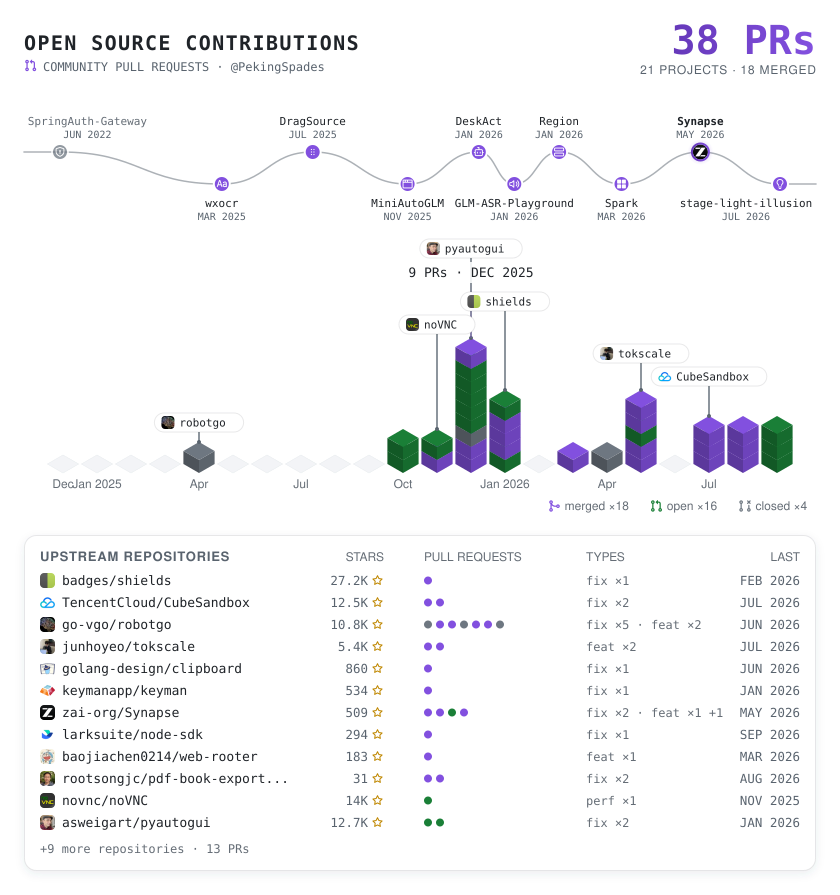
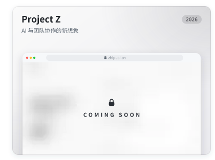
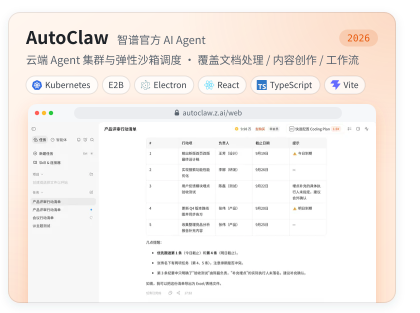
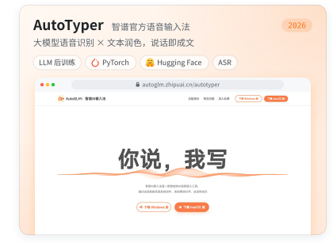
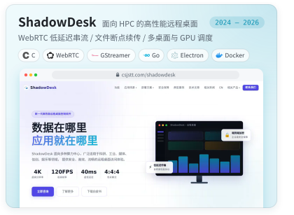
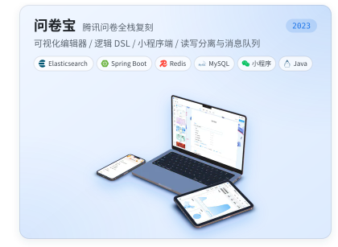
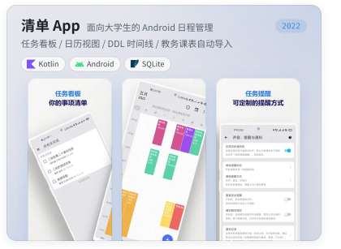
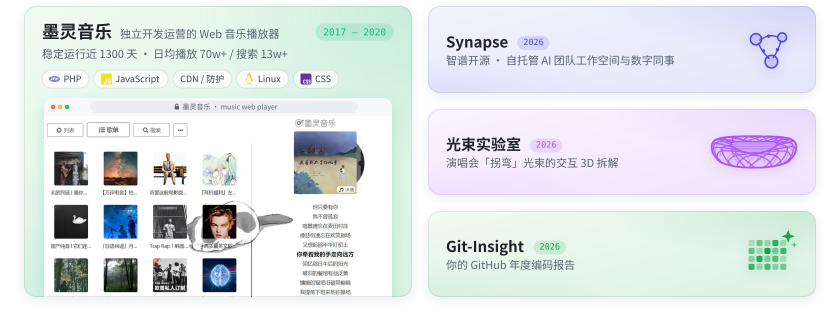
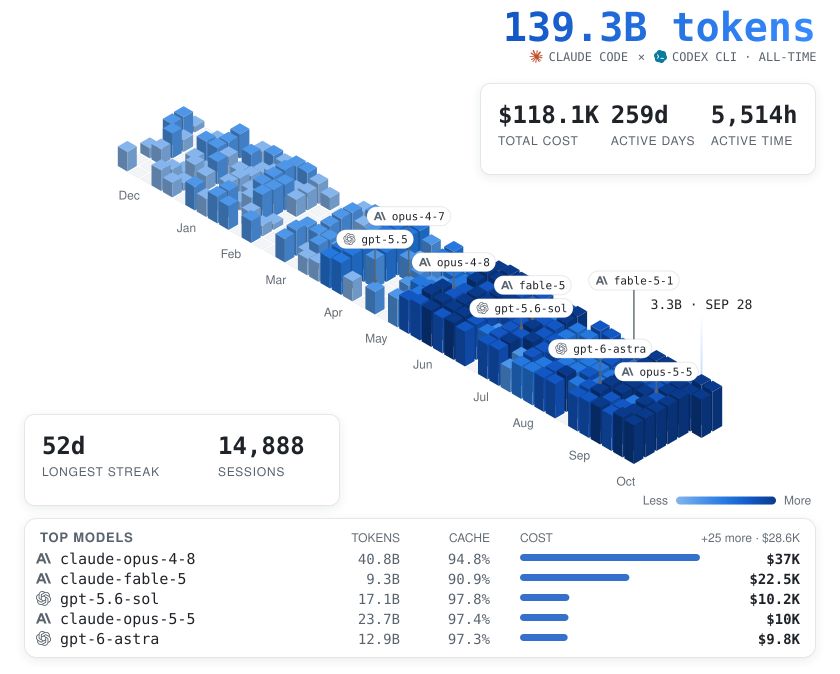

# Hi, I'm PekingSpades 👋

Building interesting and meaningful projects.

<!-- oss-contributions:start -->

  <a href="https://github.com/search?q=author%3APekingSpades+-org%3Apkuhpc+-user%3APekingSpades&type=pullrequests">
    <picture>
      <source media="(prefers-color-scheme: dark)" srcset="./assets/oss-contributions-dark.svg">
      <source media="(prefers-color-scheme: light)" srcset="./assets/oss-contributions-light.svg">
      
    </picture>
  </a>

<!-- oss-contributions:end -->

<!-- portfolio:start -->
## Portfolio · 作品集

<picture><source media="(prefers-color-scheme: dark)" srcset="./assets/portfolio/ztag-dark.svg"><source media="(prefers-color-scheme: light)" srcset="./assets/portfolio/ztag-light.svg"></picture><a href="https://autoclaw.z.ai/"><picture><source media="(prefers-color-scheme: dark)" srcset="./assets/portfolio/autoclaw-dark.svg"><source media="(prefers-color-scheme: light)" srcset="./assets/portfolio/autoclaw-light.svg"></picture></a> <a href="https://autoglm.zhipuai.cn/autotyper/"><picture><source media="(prefers-color-scheme: dark)" srcset="./assets/portfolio/autotyper-dark.svg"><source media="(prefers-color-scheme: light)" srcset="./assets/portfolio/autotyper-light.svg"></picture></a><a href="https://csjstt.com/shadowdesk/"><picture><source media="(prefers-color-scheme: dark)" srcset="./assets/portfolio/shadowdesk-dark.svg"><source media="(prefers-color-scheme: light)" srcset="./assets/portfolio/shadowdesk-light.svg"></picture></a> <picture><source media="(prefers-color-scheme: dark)" srcset="./assets/portfolio/survey-dark.svg"><source media="(prefers-color-scheme: light)" srcset="./assets/portfolio/survey-light.svg"></picture><picture><source media="(prefers-color-scheme: dark)" srcset="./assets/portfolio/taskly-dark.svg"><source media="(prefers-color-scheme: light)" srcset="./assets/portfolio/taskly-light.svg"></picture> <picture><source media="(prefers-color-scheme: dark)" srcset="./assets/portfolio/moling-more-dark.svg"><source media="(prefers-color-scheme: light)" srcset="./assets/portfolio/moling-more-light.svg"></picture>

<!-- portfolio:end -->

<!-- vibe-coding:start -->

  <picture>
    <source media="(prefers-color-scheme: dark)" srcset="./assets/vibe-coding-dark.svg">
    <source media="(prefers-color-scheme: light)" srcset="./assets/vibe-coding-light.svg">
    
  </picture>

<!-- vibe-coding:end -->

---

## Tech Stack

)

---

  <i>Focused on memory safety, cross-platform compatibility, and developer tooling.</i>

