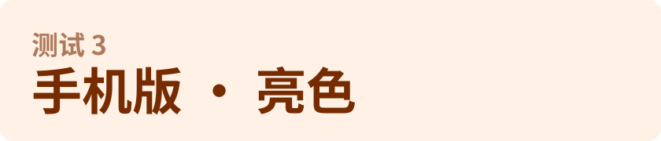
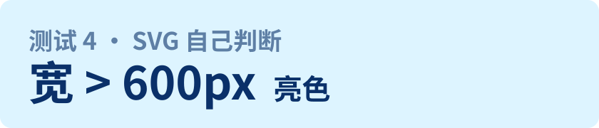

# 手机适配测试（临时分支，测完即删）

请用 **手机浏览器**、**GitHub App** 各打开一次本页，再用 **电脑** 打开一次，记下每个测试显示的文字。
另外告诉我两件事：GitHub 设置里的主题（Settings → Appearance）选的是什么；手机系统当时是不是深色模式。

### 测试 1：宽度 + 深浅色（手机用 max-width 条件）

<picture><source media="(max-width: 600px) and (prefers-color-scheme: dark)" srcset="./mobile-test/t1-mobile-dark.svg"><source media="(max-width: 600px)" srcset="./mobile-test/t1-mobile-light.svg"><source media="(prefers-color-scheme: dark)" srcset="./mobile-test/t1-desktop-dark.svg"><source media="(prefers-color-scheme: light)" srcset="./mobile-test/t1-desktop-light.svg"></picture>

预期：手机显示「手机版」，电脑显示「电脑版」；亮色 / 暗色跟随主题。

### 测试 2：只按宽度切换

<picture><source media="(max-width: 600px)" srcset="./mobile-test/t2-mobile-light.svg"></picture>

预期：手机显示「手机版 · 亮色」，电脑显示「电脑版 · 亮色」（这一组不区分深浅色）。

### 测试 3：默认图是手机版（电脑用 min-width 条件）

<picture><source media="(min-width: 601px) and (prefers-color-scheme: dark)" srcset="./mobile-test/t3-desktop-dark.svg"><source media="(min-width: 601px)" srcset="./mobile-test/t3-desktop-light.svg"><source media="(prefers-color-scheme: dark)" srcset="./mobile-test/t3-mobile-dark.svg"></picture>

预期同测试 1。区别在于：如果某个环境不认 `<picture>`，测试 1 会显示「电脑版」，测试 3 会显示「手机版」。

### 测试 4：SVG 自己判断自己的显示宽度

这是同一张图，靠 SVG 内部的样式判断它被显示成多宽、系统是不是深色。
